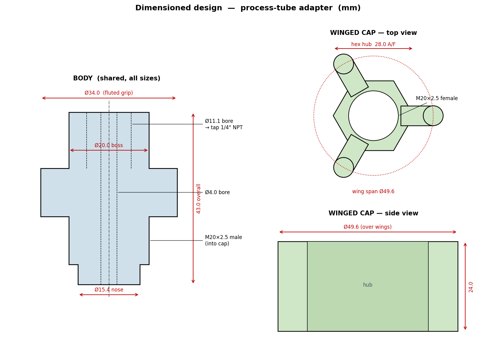

# Process-Tube Adapter (3D-printable, R600a)

A printable reimplementation of the Robinair-style **process-tube adapter** — the tool
that clamps onto a sealed system's copper **process stub** so you can pull a vacuum and
recharge without flaring the tube. Designed for **R600a (isobutane)** domestic
refrigeration, where working pressures are low and the real requirement is **vacuum
integrity**, not high-pressure containment.

The rigid parts are printed; the **seal is a purchased Viton O-ring**; the **flare is a
purchased brass fitting**. Nothing safety-critical relies on a printed sealing surface.


## How it works

One common **body** screws into a per-size **cap**. The copper stub slides up through the
cap. A **Viton O-ring** sits in the cap's gland and seals **radially** against the tube OD
(squeezed ~15% between the tube and the gland bore — the way an O-ring is meant to work).
A thin **washer** caps the gland as anti-extrusion insurance. Refrigerant exits the open
cut end of the stub straight up the body bore to the hose.

The hose connection is a **purchased brass 1/4" SAE male-flare × 1/4" MNPT adapter** that
threads into a tapped boss on top of the body — so the brass owns the flare seal.


## Bill of materials

Per assembly:
- 1 × printed **body** (shared across all tube sizes)
- 1 × printed **cap** for the tube size in use
- 1 × printed **washer** for that size (or a metal flat washer)
- 1 × **Viton O-ring** (Harbor Freight 180-pc Viton kit, SKU 67525)
- 1 × **brass 1/4" SAE male-flare × 1/4" MNPT** adapter (any HVAC supplier)
- Thread sealant (PTFE paste or Loctite 565) for the brass-into-boss joint

### Tube size → cap → O-ring

| Tube OD | Cap file | Gland bore | Viton ring (AS568) | Ring ID × CS |
|---------|----------|-----------|--------------------|--------------|
| 3/16"   | cap_3-16 | Ø7.8 mm   | A008               | 4.47 × 1.78  |
| 1/4"    | cap_1-4  | Ø9.4 mm   | A010               | 6.07 × 1.78  |
| 5/16"   | cap_5-16 | Ø11.0 mm  | A011               | 7.65 × 1.78  |
| 3/8"    | cap_3-8  | Ø12.6 mm  | A012               | 9.25 × 1.78  |

All rings are the 1/16" (1.78 mm) cross-section so the gland is uniform.

## Printing

- **Body + caps:** PA-CF or PETG-CF, ≥4 walls, 0.2 mm layers.
- Print the **body boss-up** so the NPT threads aren't on a support interface.
- **Washers:** print in CF, or substitute metal flat washers (IDs in the table/script).
- The body↔cap (M20×2.5) threads already include 0.4 mm clearance for FDM.

## Assembly

1. Tap the body's boss **1/4" NPT** (the Ø11.1 mm bore is the correct tap-drill — no
   drilling needed). Thread in the brass flare adapter with PTFE paste.
2. Slide the Viton O-ring onto the cut process stub.
3. Slide the cap on, drop the washer in, thread the body into the cap **by hand** (the
   fluted barrel and cap wings give enough grip — no wrench at R600a pressures).
4. Connect the charging hose to the brass flare. Evacuate / recharge.

## Verify before live use

Pull a vacuum on a printed cap + Viton ring on a scrap stub and watch a micron gauge for a
few minutes. If it creeps, add a wipe of vacuum grease under the O-ring or bump `SQUEEZE`
in `generate.py` and reprint the cap. **R600a is flammable** — observe normal ventilation
and ignition discipline.

## Regenerating / modifying

Every dimension is a named constant at the top of `generate.py`. Change a number, re-run,
and all nine STL/STEP files are rebuilt:

```bash
pip install build123d bd_warehouse      # Python 3.10+
python3 generate.py                     # writes ./stl and ./step
```

`generate_commented.py` is the same script with plain-English comments on every line.
The `.step` files open natively in FreeCAD / Fusion / Onshape for hands-on edits.

## Dimensions



## License

MIT — see [LICENSE](LICENSE).
