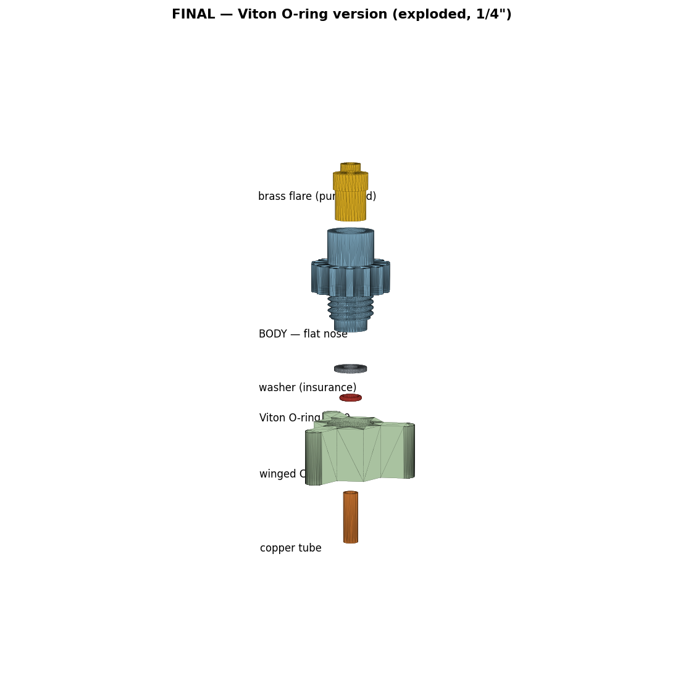
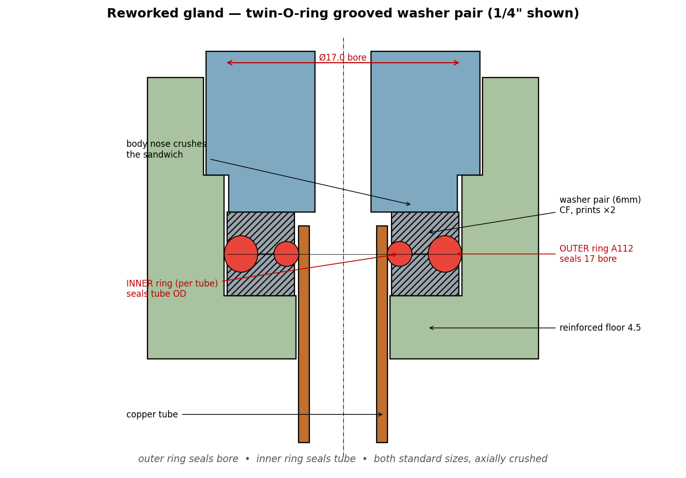

# Process-Tube Adapter (3D-printable, R600a)

A printable reimplementation of the Robinair 12458 **process-tube adapter** — the tool
that clamps onto a sealed system's copper **process stub** so you can pull a vacuum and
recharge without flaring the tube. Designed for **R600a (isobutane)** domestic
refrigeration, where working pressures are low and the real requirement is **vacuum
integrity**, not high-pressure containment.

The rigid parts are printed; the **seals are purchased O-rings**. Nothing safety-critical
relies on a printed sealing surface.



## How it works

One common **body** screws into a per-size **cap**. The copper stub slides up through the
cap's reinforced floor. Inside the cap's 17 mm bore sits a **pair of grooved washers** that
sandwiches **two standard O-rings**:

- the **outer ring** seals radially against the **17 mm cap bore**
- the **inner ring** seals radially against the **copper tube OD**

This splits the two sealing jobs the original Robinair crammed into one fat custom seal —
so both rings are common catalog sizes. The body's **clearance plunger nose** drives the
sandwich down; crush is **thread-driven with no hard stop**, so FDM tolerance variation
changes only how far you thread, never whether the rings seal. Refrigerant exits the open
cut end of the stub, up the body bore, to the hose.



## Sealing — design notes

- **Reinforced 4.5 mm floor.** An earlier 2.5 mm floor buckled under crush load; the floor
  is now a solid anvil with only a tube-clearance hole.
- **No bottoming shoulder.** The plunger nose (Ø15 in the 17 bore) never lands metal-to-
  metal — the rings always take the load. Tighten until firm.
- **Groove dimensions** (outer 3.0 x 1.4, inner 2.0 x 1.0) are a first cut for ~20 % squeeze
  and are meant to be tuned after a test fit. Adjust `OG_D` / `IG_D` in `generate.py`.

## Bill of materials

Per assembly:
- 1 x printed **body** (shared across all tube sizes)
- 1 x printed **cap** for the tube size in use
- 2 x printed **grooved washers** for that size
- 1 x **outer O-ring** (seals the bore) + 1 x **inner O-ring** (seals the tube)
- 1 x **brass 1/4" SAE male-flare x 1/4" MNPT** adapter for the hose (threads into the body boss)
- Thread sealant (PTFE paste) for the brass-into-boss joint

### Tube size -> cap -> O-rings

| Tube OD | Cap / washer | Outer ring (bore) | Inner ring (tube) |
|---------|--------------|-------------------|-------------------|
| 3/16"   | `*_3-16`     | A112 (12.37x2.62) | A008 (4.47x1.78)  |
| 1/4"    | `*_1-4`      | A112              | A010 (6.07x1.78)  |
| 5/16"   | `*_5-16`     | A112              | A011 (7.65x1.78)  |
| 3/8"    | `*_3-8`      | A112              | A012 (9.25x1.78)  |

The **outer ring is the same A112 for all four caps** (always sealing the 17 mm bore);
only the inner ring changes with tube size. Viton/FKM 75 Shore A recommended.

## Printing

- **Body + caps + washers:** PA-CF or PETG-CF, >=4 walls, 0.2 mm layers.
- Print the **body boss-up** so the NPT threads aren't on a support interface.
- Vertical circular holes run undersized on many printers — run X-Y hole compensation
  (~+0.15 mm) and verify the gland bore on a test print before committing all four.

## Assembly

1. Tap the body boss **1/4" NPT** (the Ø11.1 mm bore is the tap-drill — no drilling). Thread
   in the brass flare adapter with PTFE paste.
2. Drop the outer ring into the washers' outer pockets and the inner ring into the inner
   pockets; bring the washer pair together around the cut stub.
3. Slide the cap over the stub, thread the body in **by hand** until firm (wings + flutes
   give the grip — no wrench at R600a pressures).
4. Connect the charging hose to the brass flare. Evacuate / recharge.

## Verify before live use

Pull a vacuum on an assembled cap on a scrap stub and watch a micron gauge. If it creeps,
deepen the groove(s) slightly (`OG_D`/`IG_D`) for more squeeze and reprint the washers.
**R600a is flammable** — observe ventilation and ignition discipline.

## Regenerating / modifying

Every dimension is a named constant at the top of `generate.py`:

```bash
pip install build123d bd_warehouse
python3 generate.py        # writes ./stl and ./step
```

`.step` files open natively in FreeCAD / Fusion / Onshape for hands-on edits.

## License

MIT — see [LICENSE](LICENSE).
